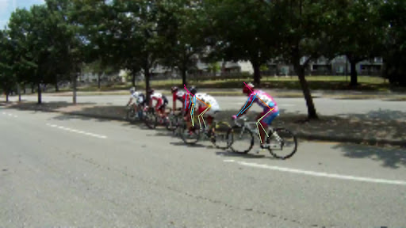

# Comparing Methods for Multi-Person Human Pose Estimation

  

## Project Overview

Human pose estimation is a fundamental computer vision task with applications in sports analytics, robotics, and augmented reality. This project compares three distinct methodologies, analyzing the tradeoffs between accuracy and computational efficiency. **Find the full report with visualizations [here](assets/report.pdf)**.

This repository contains the implementation of three different approaches for multi-person 2D pose estimation:

1. **Custom Top-Down Architecture** - Using Swin Transformer [[1]](https://arxiv.org/pdf/2103.14030) backbones and YOLOv8 for person detection
    - Implemented by [@npragin](github.com/npragin) in `top_down/`

2. **Bottom-Up Architecture** - Inspired by OpenPose with Part Affinity Fields [[2]](https://arxiv.org/pdf/1812.08008)
    - Implemented by [@AandBstudent](github.com/AandBstudent) in `bottom_up/`

3. **End-to-End Transformer-based Architecture** - Based on PETR (Pose Estimation with TRansformers) [[3]](https://openaccess.thecvf.com/content/CVPR2022/papers/Shi_End-to-End_Multi-Person_Pose_Estimation_With_Transformers_CVPR_2022_paper.pdf)
    - Adapted for MPII by [@BryanZChen](github.com/BryanZChen) in `e2e/`

## Approaches

### 1. Custom Top-Down Approach
- **Background**:
  - Top-down approaches detect individual people in the image and feed each person into a single-person pose estimator
- **Architecture**:
  - Two-stage pipeline using YOLO-v8 for person detection
  - Swin Transformer backbone (Swin-S for 50M model, Swin-B for 100M model)
  - Two MLP heads for keypoint visibility classification and coordinate regression
- **Training**:
  - Loss function combining binary cross-entropy and smooth L1 loss

### 2. Bottom-Up Approach
- **Background**:
  - Bottom-up approaches identify all keypoints present in the full image, then group them into individual people
- **Architecture**:
  - ResNet-50 backbone followed by iterative refinement stages
  - Predicts heatmaps for joint locations and Part Affinity Fields (PAFs) for limb connections
  - Multi-stage refinement to enhance prediction accuracy
- **Training**:
  - Optimizes using MSE loss between predicted and ground-truth heatmaps/PAFs

### 3. End-to-End Approach (PETR)
- **Background**:
  - End-to-end approaches directly process the input image in a single unified network without explicitly separating the person detection and keypoint localization steps
- **Architecture**:
  - Based on Pose Estimation with TRansformers (PETR)
  - Uses ResNet-50 or Swin-B backbone
  - Directly predicts human keypoints from multi-scale feature maps
- **Training**:
  - Direct optimization on OKS loss (L = 1 - OKS)

## Experimental Design

### Object Keypoint Similarity (OKS)

Object Keypoint Similarity (OKS) is the primary metric for evaluating human pose estimation performance. OKS is analogous to IoU (Intersection over Union) in object detection but designed explicitly for keypoint-based tasks.

The OKS between a predicted pose and a ground truth pose is calculated as:

$$\text{OKS} = \frac{\sum_i \exp(-d_i^2 / (2s^2 k_i^2)) \delta(v_i > 0)}{\sum_i \delta(v_i > 0)}$$

Where:
- $d_i$ is the Euclidean distance between the predicted keypoint and ground truth keypoint
- $s$ is the object scale (square root of the person bounding box area)
- $k_i$ is a per-keypoint constant that controls relative importance (different joints have different importance)
- $v_i$ is the visibility flag of the ground truth keypoint
- $\delta(v_i > 0)$ is 1 if the keypoint is visible, 0 otherwise

Higher OKS values indicate better alignment between predicted and ground truth poses, with 1.0 representing a perfect match.

### Experimental Controls

To ensure a fair comparison across all three architectural approaches, we implemented strict experimental controls:

1. **Parameter Normalization**: All models were constrained to parameter counts within ±3% of each other to normalize computational capacity. We created variants at two complexity levels, 50M and 100M parameters.

2. **Consistent Dataset Handling**: All models were trained on identical subsets of the MPII human pose dataset, with seven-eighths used for training and one-eighth reserved for evaluation.

3. **Standardized Data Augmentation**: We applied the same augmentation techniques across all experiments:
   - Color jittering with uniform hyperparameters
   - Standardized image sub-sampling to predetermined dimensions
   - Normalization using ImageNet statistical parameters

## Experimental Results

| Model | Train OKS | Test OKS |
|-------|----------|----------|
| Custom Top-down 50M | 0.670 | 0.622 |
| Custom Top-down 100M | 0.732 | 0.668 |
| SOTA E2E 50M | 0.917 | 0.896 |
| SOTA E2E 100M | 0.903 | 0.897 |
| SOTA Bottom-up 50M | 0.470 | 0.237 |
| SOTA Bottom-up 100M | 0.441 | 0.324 |

The end-to-end detection model (PETR) significantly outperformed both top-down and bottom-up approaches in our experiments.

## Key Findings

1. **End-to-end models perform best** for multi-person pose estimation tasks

2. **Parameter scaling effects vary** across architectures
    - Top-down: +7.4% OKS improvement
    - End-to-end: Minimal impact (+0.1% OKS)
    - Bottom-up: +36.7% OKS improvement, but from a lower baseline

3. **Multi-scale feature maps and positionally invariant decoders** are critical for accurate pose estimation
    - Their absence likely contributes to our custom top-down model's lower performance.

4. **Top-down approaches** offer good accuracy, but computation at inference scales linearly with the number of people in the image

5. **Bottom-up approaches** suffer in accuracy but maintain computational efficiency regardless of person count

6. **Practical deployment considerations**
    - For high-accuracy requirements (medical, sports analytics): End-to-end models are recommended
    - For real-time applications with moderate accuracy needs in high-density environments: Bottom-up models provide the highest throughput
    - For balanced performance: End-to-end models with the 50M parameter configuration offer the best tradeoff

## Future Work

### Overall Improvements
- Implement rotation and translation data augmentation for emphasis on rotational and positional invariance and equivariance

### Top-Down Approach Improvements
- Implement multi-scale feature pyramid networks to better handle various human scales
- Develop positionally and rotationally invariant/equivariant decoders to improve generalization

### Bottom-Up Approach Improvements
- Implement dynamic bounding box computation to replace the fixed scaling factor

## Citations
[1] Z. Liu et al., "Swin Transformer: Hierarchical Vision Transformer using Shifted Windows," ICCV 2021.

[2] Z. Cao et al., "Realtime Multi-Person 2D Pose Estimation using Part Affinity Fields," CVPR 2017.

[3] D. Shi et al., "End-to-End Multi-Person Pose Estimation with Transformers," CVPR 2022.

## License

This project is released under the GPLv3 License.
